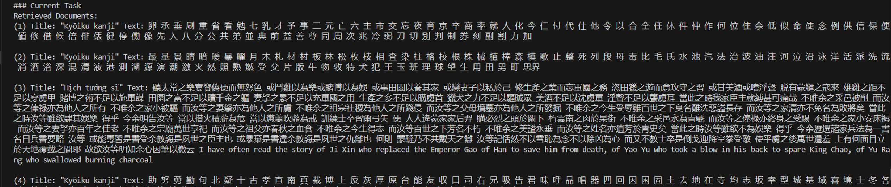

# 2025 CCF BDCI - 基于 FlashRAG 的智能 DeepSearch 系统设计

**队伍名称：不是有效的JSON格式** 

**最终成绩：A榜 Top 5 / B榜 Top 7**

---

## 📢 前言与求职

本项目是 **2025 CCF BDCI 大数据与计算智能大赛** — [《英博云-基于FlashRAG的智能DeepSearch系统设计》](https://www.xir.cn/competitions/1156) 赛道的解决方案。

比赛结束一个月了，总算是抽出来时间稍微整理一下，这个比赛大概做了一周，之前并没有具体接触过RAG，好在几个小伙伴都对新技术抱有极大的热情，边做边学，在 A 榜阶段长期保持第一。虽然后期因测试集泄露问题（ 有队伍发现测试集源自 BrowseComp 和 WebWalker 数据集）导致很多人断崖式领先，但我们自认为这套方案在这个比赛中可以算是top方案，当然肯定问题很多，时间有点久，有的细节我也记不清了，开源出来大家一起学习，我们在RAG方面也是小白。

👨‍💻 **关于团队**：
成员均来自 **电子科技大学未来媒体研究中心（研二）**，研究方向涵盖 **AI Safety, Agent, Video Generation**。团队算法竞赛经验丰富，曾获：

* 第二届全球数智教育创新大赛金奖
* 中国高校计算机大赛大数据挑战赛全国一等奖
* CCF BDCI大数据与计算智能大赛全国一等奖
* 启元实验室—面向多模态大模型对抗挑战赛全国二等奖
* 第四届“天马杯”全国高校科技创新大赛总决赛全国二等奖
* 中国机器人大赛暨ROBOCUP机器人世界杯中国赛全国二等奖
* 重庆市首届人工智能创新大赛一等奖
* ...

🚀 **求职意向**：
**团队成员能力较强，motivation特别足，具有较高的科研素养和工程实践能力，对技术充满热情，诚求26年 7-10 月份的大厂暑期算法实习机会（带HC的offer）。**
联系邮箱：`wslliongliong@gmail.com` 

---

## 1. 赛题理解

### 1.1 赛题背景
比赛目标是基于 **FlashRAG** 框架，设计一个能够处理复杂查询的 DeepSearch 系统。
* **数据源**：主办方提供的约 2000 万文本块的 Wiki 知识库（允许联网检索补充）。
* **难点**：问题包含“复杂推理”和“深度问答”两类，部分问题无法仅靠本地库回答，且对答案的全面性和详细度要求极高。
* **约束**：必须在英博云平台运行，模型参数限制在 32B 以内。

### 1.2 评价指标
比赛采用 **语义相似度** 作为核心指标。使用 `sentence-transformers/all-mpnet-base-v2` 将预测答案与标准答案编码为向量，计算余弦相似度。

---

## 2. 总体方案

我们采用了经典的 **Retriever-Reranker-Generator** 范式，并针对赛题难点增加了 **Web 增强** 和 **后处理** 机制。

处理流程共分为五个阶段：

1.  **查询理解与扩展**
    * 利用 `Qwen3-30B-A3B-Instruct-2507` 对原始复杂问题进行分析，提取**最具区分度**的搜索关键词（专门针对 Web 搜索优化，去除干扰词）。

2.  **混合检索**
    * **本地检索**：使用 FlashRAG `DenseRetriever` (E5模型) 从本地 Wiki 语料库检索 Top-60 文档。
    * **Web 检索**：利用提取的关键词调用 `Serper API`，并发抓取网页内容，获取 Top-10 外部文档。
    * **混合策略**：将本地和 Web 结果合并构建候选池（共70 条）。

3.  **重排**
    * 使用高精度 Cross-Encoder 模型 `bge-reranker-v2-minicpm-layerwise` 对候选池中的 `(Question, Document)` 对进行打分，筛选相关性最高的 **Top-5** 文档作为最终上下文。

4.  **生成回答**
    * 构建 **Few-shot Prompt**（包含 4 个example），将 Top-5 文档和问题输入给生成模型 `Qwen3-30B-A3B-Instruct`。

5.  **后处理**
    * **拒答检测**：检测模型输出是否包含“无法确定”、“未提供”等拒答关键词。
    * **强制回答**：若触发拒答，则通过二次 Prompt 强制模型利用常识或现有片段给出最可能的答案。

---

## 3. 核心上分策略

以下是我们经过验证有效的策略（Work）：

1.  **基于 LLM 的关键词提取**：原始问题直接用于 Web 搜索效果极差，干扰过多。通过 LLM 提取核心实体和属性词后再检索，召回率显著提升。
2.  **“宽进严出”的混合检索**：本地库+Web 混合检索，配合大参数量的 Rerank 模型（bge-reranker-v2-minicpm-layerwise），取38层的embedding进行排序。Web 负责覆盖长尾知识，Rerank 负责过滤噪声。
3.  **Monkey Patch 修复框架 Bug**：发现 FlashRAG 的源码 `Encoder.encode` 函数在处理单个 str 输入时存在截断 bug，导致语义向量不完整。我们通过打补丁（Monkey Patch）修复了此问题。
4.  **形式化输出拟合**：针对模型回答格式不规范的问题，通过字符串匹配和正则进行后处理。
5.  **生成模型选型**：选择了 `Qwen3-30B-A3B-Instruct-2507`。我们在实验中发现，对于此类高难度 factual 问题，Thinking 模型容易陷入 CoT 循环或过度自我怀疑，效果反而不如直接指令微调模型。
6.  **答案精简策略**：观察发现 Ground Truth 通常短小精悍。我们限制了生成长度，只取模型回答的关键部分，避免过度解释导致相似度分数下降。

---

## 4. 其他不太work尝试

以下方案在本次比赛中未见效，虽然有些理论分析非常work！：

* **Query Refine**：尝试先用 LLM 改写问题再检索，导致语义漂移，效果下降。
* **多轮/迭代检索**：尝试了多种多轮检索流程，增加了耗时但未显著提升准确率。
* **多轮生成 (Self-Refine)**：让模型先回答，再用“问题+回答”去检索验证，效果不佳。
* **分路检索**：尝试让中英文问题走不同的检索路径，过于复杂且收益微小。
* **更换 Embedding 模型**：尝试了 `bge-m3`, `multilingual-e5-small` 等，效果均不如基线 `e5-base-v2`（原因见下文分析）。
* **引入稀疏检索**：尝试引入 BM25 进行加权，但在语义匹配主导的赛题中贡献不大。
* **更换web搜索引擎**

---

## 5. Some Insights
我们做的尝试很多，每个尝试都是经过思考后才行动的，而非trick的叠加，这里挑几个我感觉比较有意思的点和大家分享下：

### 5.1 关于选取生成模型及嵌入、重排模型
1. 针对这个赛题，问题很难，所以模型基本上不可能靠已有知识进行准确生成，模型能力的影响体现在对rag返回文档的summary能力和生成能力，这个是选择整个rag流程里面参数量最大模型的选择标准。
2. METB榜单：https://huggingface.co/spaces/mteb/leaderboard ，可以借鉴这个上面对benchmark测试出来的指标进行模型选择。
### 5.2 关于 Embedding 与乱码文档
通过对数据和结果分析，我们发现大量中文问题检索出了相同的“乱码文档”。这些文档与大部分句子的向量相似度都在 0.7 左右。
 
起初我们认为是官方提供的 `e5-base-v2` (English-only) 对中文支持不佳。但奇怪的是，无论是更换多模态 Embedding，还是换用更大参数的 `e5-large`，甚至换用中文友好的模型，**结果依然不好**。
我们分析有两个原因：
1.  **Wiki 知识库本身的中文覆盖率极低**，导致根本检索不到相关文档。
2.  **评价指标的偏差**（见下条）。

### 5.3 评价指标的局限性
比赛使用的 `all-mpnet-base-v2` 也是一个在英文语料上训练的模型。我们测试发现，**两个随机的中文句子相似度可能高达 0.5，而对应的英文句子只有 0.05**。
这意味着，在中文场景下，该指标很难精确区分“回答正确”和“回答沾边”。除非完全命中标准答案，这种情况下编码出来的两个向量是完全一样的，否则分数波动充满了随机性。

---

## 6. 环境依赖与运行

本项目代码基于 [FlashRAG](https://github.com/RUC-NLPIR/FlashRAG) 框架。

### 环境安装
请参考 FlashRAG 官方仓库配置基础环境。
### 运行推理
所有核心逻辑封装在脚本中，直接运行即可：
```bash
python inference.py
```
*(注：请确保已配置好 Serper API Key 及模型路径)*

---

## 7. 碎碎念与致谢

从大二第一次做算法竞赛至今已有接近四年，看着身边许多做竞赛的大佬逐渐淡出圈子，或转向kaggle，心中难免感慨。

CCF BDCI在我看来，算是国内竞赛含金量还可以的比赛，我也陆陆续续参加了三次，算是老玩家了。类似数据集泄露的事情，也发生过，比如22年的工业知识图谱关系抽取，当时主办方临时更换了B榜的测试集，应对很及时。但是25年，也就是今年的BDCI，竞赛平台从DataFountain换到了息壤，赛题数量也锐减到4个，数据集泄露发生后官方无人处理，复现结果不公开。

做比赛虽是为了奖金和荣誉，但更希望是在公平的环境下切磋交流技术，这应该是我最后一次参加 BDCI 了，以此代码开源纪念这段时光。希望国内的算法竞赛生态能越来越好，也祝大家在 AI 的路上越走越远！

---

**⭐ 如果这个项目对你有帮助，欢迎给一个 Star！**


